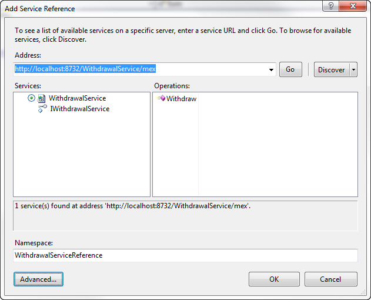
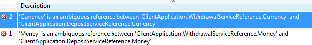
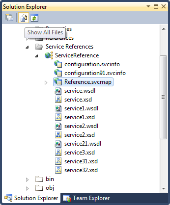

# WCF: Sharing Types Using .SvcMap

## Introduction

Suppose you have to create an application which consumes a couple of web services offered by a third party. For this post, let's assume a bank offers a financial API and opted to expose it across multiple endpoints.

Imagine two simple services. One which allows you to withdraw money and another one for depositing money.

- http://localhost:8732/WithdrawalService
- http://localhost:8733/DepositService

Both of these services use a collection of types that are shared between them. How can we make sure these types are also shared on the client side?

Let's find out...

## The Services

What do these services look like?

The withdrawal service offers a Withdraw() operation that accepts a credit card number, a security code and the amount to withdraw.

```csharp
[ServiceContract(Namespace = "http://cgeers.com/services/atm/")]
public interface IWithdrawalService
{
    [OperationContract]
    bool Withdraw(string cardNumber, string securityCode, Money amount);
}
```

The deposit service looks very similar and offers a Deposit() operation that accepts the same parameters as the Withdraw() operation .

```csharp
[ServiceContract(Namespace = "http://cgeers.com/services/atm/")]
public interface IDepositService
{
    [OperationContract]
    bool Deposit(string cardNumber, string securityCode, Money amount);
}
```

Both return a boolean to indicate if the operation succeeded.

## Common Types

As you can see in the above code listings, both of these services use a common type which is shared between them, namely the Money type.

```csharp
[DataContract(Namespace = "http://cgeers.com/services/atm/common/types/")]
public class Money
{
    [DataMember]
    public decimal Amount { get; set; }

    [DataMember]
    public Currency Currency { get; set; }
}
```

The Money class type uses a Currency enumeration to denote the currency of the amount.

```csharp
[DataContract(Namespace = "http://cgeers.com/services/atm/common/types/")]
public enum Currency
{
    [EnumMember]
    Euro,
    [EnumMember]
    Usd,
    [EnumMember]
    PoundSterling
}
```

Both of these common types (Money & Currency) use the same namespace (http://cgeers.com/services/atm/common/types/) for the data contracts of the types.

## Service References

Assume we are creating a simple console application which consumes these services. First I implement the withdraw feature.

I add a new service reference to the withdrawal service and import the client generated code into its own namespace (WithdrawalServiceReference).



After creating the service reference I can withdraw money in the following manner:

```csharp
using (var proxy = new WithdrawalServiceClient())
{
    var amount = new Money();
    amount.Amount = 100;
    amount.Currency = Currency.Euro;
    if (proxy.Withdraw("MasterCard", "1234", amount))
    {
        Console.WriteLine("Withdrawal succeeded.");
    }
    else
    {
        Console.WriteLine("Withdrawal failed.");
    }
}
```

Now let's try to deposit some money. I have to create a service reference for the deposit service (DepositServiceReference namespace) in order to do so. Once I have created the service reference, the code shown in the previous listing will no longer compile. The compiler throws errors indicating that there are ambiguous references for the Money and Currency types!



When I created the service references for the Withdrawal and Deposit services, Visual Studio generated client side code for these services. However both these services use a Money and a Currency type. We know that these are the same types, alas Visual Studio treats them as separate types and generates two Money and Currency types. Once for the WithdrawalServiceReference namespace and again for the DepositServiceReference namespace.

## .SvcMap

Of course, you can easily solve this issue by using the fully qualified namespace when using these types.

```csharp
var amount = new WithdrawalServiceReference.Money();
```

But how can you prevent Visual Studio from generating client code for these common types more than once?

Quite simple, actually. You just have to know the trick to doing it. First create a service reference for one of the services. After Visual Studio has created the reference select it in the solution explorer and select the "Show All Files" option.



Double click on the "Reference.svcmap" file to open it and search for the `<MetadataSources>` element.

```csharp
<MetadataSources>
  <MetadataSource Address="http://localhost:8732/WithdrawalService/mex"
   Protocol="mex" SourceId="1" />
</MetadataSources>
```

Add the second service to this list.

```csharp
<MetadataSources>
  <MetadataSource Address="http://localhost:8732/WithdrawalService/mex"
                  Protocol="mex" SourceId="1" />
  <MetadataSource Address="http://localhost:8733/DepositService/mex"
                  Protocol="mex" SourceId="2" />
</MetadataSources>
```

Right-click on the service reference and select "Update Service Reference" in order to regenerate the client side code. Voila, presto! That's all there is too it. Now the client-side types for the Money and Currency types are only generated once.
